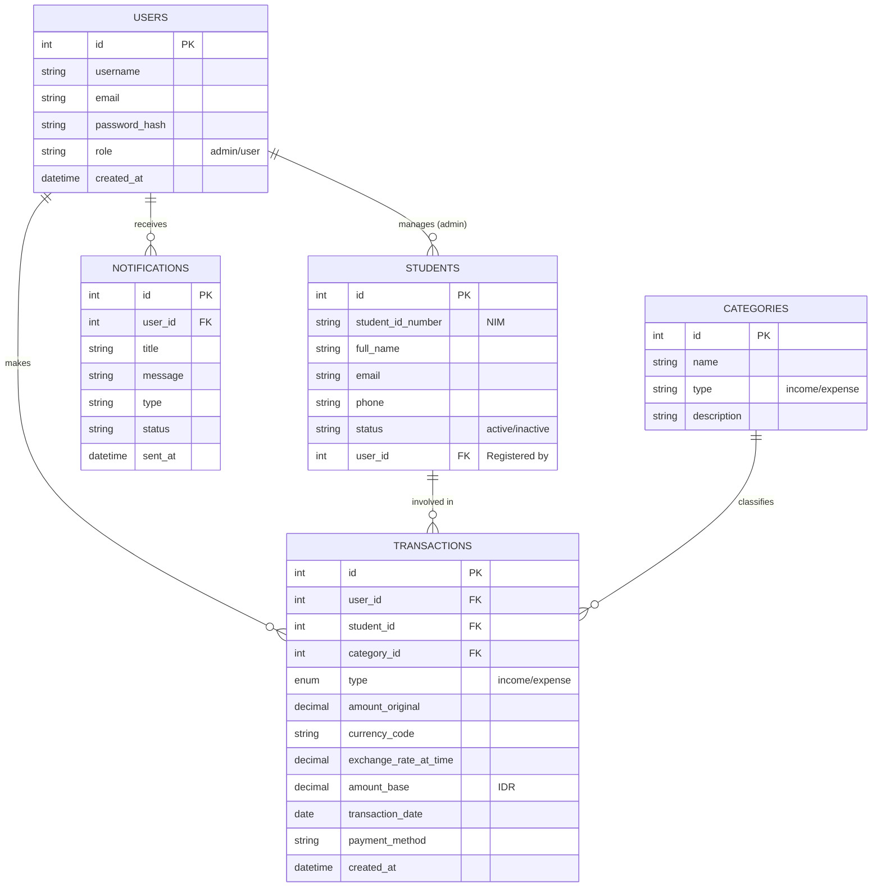

# Arsitektur Sistem & ERD

## 1. Arsitektur Sistem

Sistem ini menggunakan arsitektur **3-Tier** sederhana dengan PHP Native:
- **Presentation Layer**: HTML/CSS/JS (Frontend)
- **Application Layer**: PHP Logic (Backend Controllers & Services)
- **Data Layer**: MySQL Database

```mermaid
graph TD
    User[End User] -->|HTTPS| Web[Web Server (Apache/Nginx)]
    Web -->|PHP| Controller[Controllers / PHP Scripts]
    
    subgraph "Application Logic"
        Controller --> Auth[Auth Service]
        Controller --> Tx[Transaction Service]
        Controller --> Analytics[Analytics Service]
        Controller --> Currency[Currency API Service]
        Controller --> Notif[Notification Service]
    end
    
    subgraph "External API"
        Currency -->|Frankfurter API| ExtAPI[Exchange Rate API]
        Notif -->|SMTP| GMail[GMail SMTP]
    end
    
    subgraph "Database"
        Auth -->|Read/Write| DB[(MySQL Database)]
        Tx -->|Read/Write| DB
        Analytics -->|Read| DB
        Notif -->|Write Log| DB
    end
```

## 2. Entity Relationship Diagram (ERD)

Diagram berikut menjelaskan struktur database dan relasi antar tabel.



## 3. Alur Data Utama

### Pencatatan Transaksi
1. User input data (Jumlah, Mata Uang, Kategori).
2. Sistem cek kurs terkini via `CurrencyService` (jika mata uang asing).
3. Konversi nilai ke IDR (`amount_base`).
4. Simpan ke tabel `TRANSACTIONS`.

### Analitik & Laporan
1. `AnalyticsService` query data transaksi.
2. Agregasi by Kategori & Waktu.
3. User request Export -> `export_analytics.php` generate CSV.
